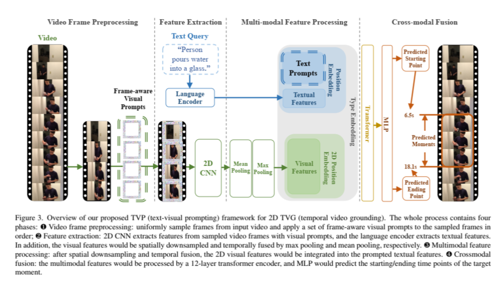
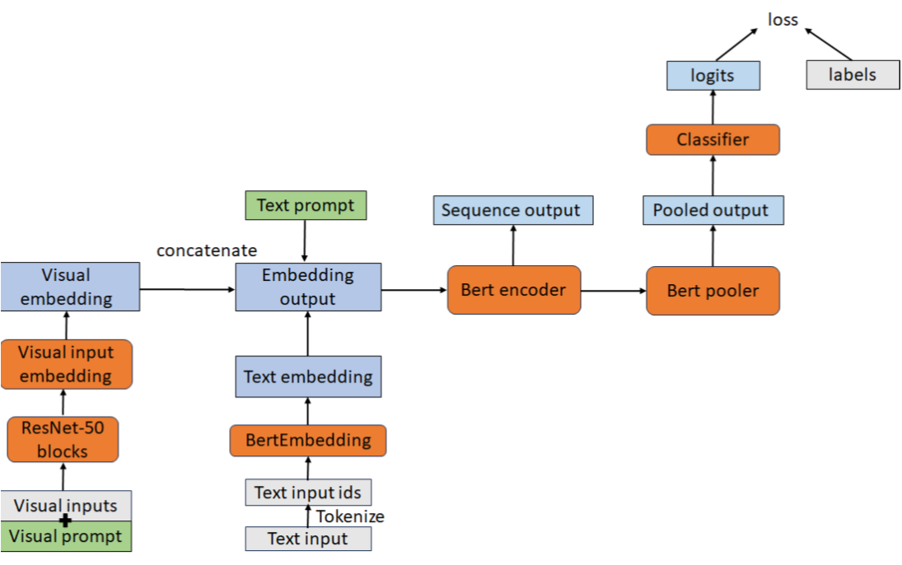
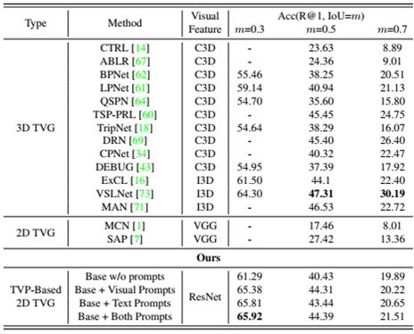
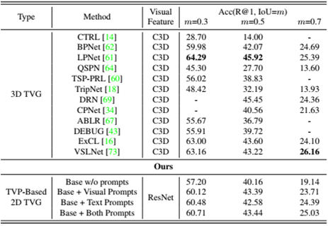

## *T*ext-*V*isual *P*rompting (TVP) Project 
### Description
Text-Visual Prompting (TVP) for Efficient 2D Temporal Video Grounding (TVG) is a novel idea in Efficient AI. Unlike most of state-of-the-art (SOTA) methods that used 3D visual features, we boost our models which inputs are 2D visual features with visual-text joint prompting, and have achieved the comparable accuracy to models utilizing 3D features.

### Methodology
#### Scheme of TVP method

Our method consists of four steps: 1: Video frame pre-processing; 2: Feature extraction; 3:Multimodal feature processing; and 4: Crossmodal fusion.
#### Model Architecure

The backbone of our model is ClipBERT and visual fearures are extracted from ResNet50.


### Pipeline
1. Pretrained model: Pretraining on large scale image-text dataset 
2. Base Model: Training on two datasets: Charades-STA and/or ActivityNet Captions.
3. Training three kinds of prompts: 1:Visual prompts only; 2: Text prompts only; and 3: Text-visual jointly prompts
4. Finetuning Model


### General

1. Data Location
    ```bash
    PATH_TO_STORAGE=/path/to/your/data/
    mkdir -p $PATH_TO_STORAGE/txt_db  # annotations
    mkdir -p $PATH_TO_STORAGE/vis_db  # image and video 
    ```
2. Data Preprocessing
    TVP takes raw video and text as inputs, there is no need to do feature extraction seperatelty. 
    However, we use LMDB to store the raw image and video files for improving data loading speed 
    You can use the following script to convert a list of videos with file extensions `mp4` and `avi` into LMDB:

    ```bash
    python src/preprocessing/file2lmdb.py \
        --data_root /path/to/videos \
        --lmdb_save_dir /path/to/save/lmdb \
        --ext avi mp4 \
        --file_type video 
    ```
    For images, use appropriate file extensions for `--ext` and `--file_type image`. 
    Text annotation files are reorganized into `jsonl` files. 

### Step 1: Pretraining
1. Download data
    ```bash
    bash scripts/download_coco_vg.sh $PATH_TO_STORAGE
    ```

2. Pretraining
    Num_GPUs: the numbers of GPUs for training
    ```bash
    horovodrun -np Nums_GPUs python src/pretrain/run_pretrain.py \
        --config src/configs/pretrain_image_text_base_resnet50_mlm_itm.json \
        --output_dir $OUTPUT_DIR 
    ``` 

### Step 2: Base Model Training

    horovodrun -np Num_GPUs python src/tasks/run_temporal_grounding_pf_prompt.py \
        --dataset charades --config src/configs/charades_pf_prompt_resnet50.json \
        --eval_dir $BASEMODEL_DIR  --inference_model_step $BASEMODEL_CHECKPOINT_STEP \
        --add_txt_prompt 0 --add_vis_prompt 0  \
        --tuning_type whole \
        --output_dir $OUTPUT_DIR


### Step 3: Prompt Training
Command:
    ```bash
    horovodrun -np Num_GPUs python src/tasks/run_temporal_grounding_pf_prompt.py \
        --dataset charades --config src/configs/charades_pf_prompt_resnet50.json \
        --eval_dir $BASE_MODEL_DIR  --inference_model_step $BASE_MODEL_CHECKPOINT_STEP \
        --output_dir $OUTPUT_DIR \
        [opinions]
    ```
    


1. Training Visual Prompts only
    ```bash
        opinion:
        --add_txt_prompt 0 --add_vis_prompt 1  \
        --tuning_type onlypad --vp_type framepad --vp_apply replace --pad_size 96 
    ```
    
2. Training Text Prompts Only
    ```bash
       opinion: 
        --add_txt_prompt 1 --add_vis_prompt 0  \
        --tuning_type onlytxt --txtp_size 10
    ```
    
3. Training Text-Visual Joint Prompts
    ```bash
        opinion:
        --add_txt_prompt 1 --add_vis_prompt 1  \
        --tuning_type txtpad --txtp_size 10 --vp_type framepad --vp_apply replace --pad_size 96 
    ```

### Step 4: Model Finetuning

    horovodrun -np 8 python src/tasks/run_temporal_grounding_pf_prompt.py \
        --dataset charades --config src/configs/charades_pf_prompt_resnet50.json \
        --eval_dir $PROMPTED_MODEL_DIR  --inference_model_step $PROMPTED_MODEL_CHECKPOINT_STEP \
        --add_txt_prompt 1 --add_vis_prompt 1  \
        --tuning_type whole --txtp_size 10 --vp_type framepad --vp_apply replace --pad_size 96 \
        --freeze_pad 1  --freeze_txtp 1 \
        --output_dir $OUTPUT_DIR

### Virtual Environment
create a virutal environment: Python>=3.7
activate your virtual environment
install pytorch, https://pytorch.org/get-started/locally/
install apex follwing https://github.com/NVIDIA/apex
install detectron2 following https://detectron2.readthedocs.io/en/latest/tutorials/install.html
then install others with requirements
### Experimental Results
We conducted experimetns on two popular datasets: Charades-STA dataset and ActivityNet Captions datasets.
#### Performance comparison of different m(0.3, 0.5 and 0.7) on Charades-STA dataset

#### Performance comparison of different m(0.3, 0.5 and 0.7) on ActivityNet Captions dataset



### Tesing  
The code was tested on 8 Nvidia V100 GPU cards with 32G cards with Ubuntu 18.04. Pytorch 1.18
We use mixed-precision training hence GPUs with Tensor Cores are recommended.


### Citation
If you find our work useful, please cite: 

```
@inproceedings{zhang2023text,
  title={Text-visual prompting for efficient 2d temporal video grounding},
  author={Zhang, Yimeng and Chen, Xin and Jia, Jinghan and Liu, Sijia and Ding, Ke},
  booktitle={Proceedings of the IEEE/CVF Conference on Computer Vision and Pattern Recognition},
  pages={14794--14804},
  year={2023}
}
```
### Acknowledgement
We develop our code based on [ClipBERT codebase](https://github.com/jayleicn/ClipBERT).


